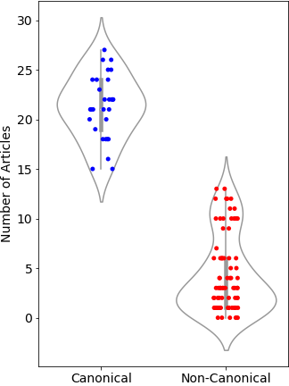

# A Corpus of Canonical and Non-Canonical Texts

Canonical fictional texts are considered to have high cultural value and are familiar to educated members of society, and are included in school curricula. Writers of canonical texts are prestigious writers and hold strong reputation.
Although canonization is a process influenced by various stakeholders, and the reputation of canonical texts is promoted by influential sectors of society, for a text to be selected in a canon, the textual properties, reading, and readership of these texts undoubtedly play crucial roles.
Conversely, non-canonical texts do not gain recognition comparable to canonical texts, and many of them may not survive, as was probably the fate of most during the pre-digitalization era.
To analyze canonical texts in comparison to non-canonical texts, we built a corpus called the **Jena Corpus of Expository and Fictional Prose (JEFP)**, which includes the two aforementioned fictional categories, canonical and non-canonical, as well as one category of non-fictional texts, which allow for inter- and intra-genre comparisons.

## Canonical Text
To select a text as a canonical text, we considered three criteria:

1.  The text has been recognized as a canonical text in _The Western Canon: The Books and School of the Ages_ (Bloom, 1994). These texts have been extracted from Project Gutenberg and collected in the _Corpus of Canonical Western Literature_ (Green, 2017).
2.  The author should have a high international reputation, measured by counting the number of pages the author has in the top 30 Wikipedia editions.
3.  The text should be long enough to facilitate structural analysis. We set a threshold of 35K tokens, including words and punctuation. This length allows us to apply various types of structural analysis, including long-range correlation analysis (fractal analysis).

In total, 76 canonical texts, written by 30 authors in the 19th and early 20th century, were incorporated in the The JEFP corpus, version 2.0.  The list of authors is as follows:

|     |     |     |
| --- | --- | --- |
| Anne Bronte | Arnold Bennett | Bram Stoker | 
| Charles Dickens | Charlotte Bronte | Edgar Allan Poe | 
| Elizabeth Gaskell | George Eliot | Henry David Thoreau | 
|Henry James | Herman Melville | James Fenimore Cooper | 
|James Joyce | Jane Austen | Joseph Conrad | 
| D.H. Lawrence | Louisa May Alcott | Mark Twain | 
| Nathaniel Hawthorne | Oscar Wilde | Rudyard Kipling | 
|Sinclair Lewis | Theodore Dreiser | Thomas Carlyle | 
|Thomas Hardy | Walter Scott | Wilkie Collins | 
|Willa Cather | William Makepeace Thackeray | William Morris |

The complete list of texts is published in this github repository.

## Non-Canonical Text
The raw texts for this corpus category were extracted from Project Gutenberg. The extraction aimed to ensure that the distribution of the years of publication is statistically indistinguishable for canonical and non-canonical texts. As of the compilation of the corpus in May 2020, none of these texts had a download count exceeding 40, as indicated on the Project Gutenberg website. This could be seen as an approach to avoid the inclusion of popular literature in the corpus. Similar to the category of canonical texts, a minimum text length of 35K tokens were applied in the selection process.
The sub-corpus of non-canonical texts includes 130 texts. Authors of non-canonical texts selected have a lower international reputation compared to canonical authors. The plot below shows the number pages dedicated to canonical and non-canonical authors on the top 30 Wikipedia editions, a metric as a proxy for international reputation. 

{(Source: mohseni et al., 2020)}

Although non-canonical authors may be less renowned than their canonical counterparts, some of them still are famous and have pages across various languages. Upon closer examination, we found that their notability is often because of activities beyond literature, such as involvement in politics.

Non-Fictional Texts
185 non-fictional texts belonging to genres like philosophy, psychology, and sociology were selected from Project Gutenberg from the same time period as the two fictional categories, i.e., the 19th and early 20th century, to build the category of non-fictional texts. 
The following table shows information about the JEFP corpus (information taken from mohseni et al., 2020):

| Category | # Texts | Mean Length |
| ---- | ---- | ---- |
| Canonical | 76 | 199 ± 96K |
| Non-Canonical | 130 | 111 ± 56K |
| Non-Fictional | 185 | 171 ± 178K |

The complete list of all texts with metadata is published in [this Github repository](https://github.com/mohsenim/JEFP-Corpus).

### References

*  Mohseni, Mahdi, Volker Gast, Christoph Redies, _Fractality and Variability in Canonical and Non-Canonical English Fiction and in Non-Fictional Texts_, Front. Psychol. 2021, 12, 920.
*  Mohseni, Mahdi, Christoph Redies, and Volker Gast, _Approximate Entropy in Canonical and Non-Canonical Fiction_, In: Entropy 24.2, 2022, p. 277. 
*  Bloom, Harold, _The Western Canon: The Books and School of the Ages_, Harcourt: New York, NY, USA, 1994.
*  Green, Clarence , _Introducing the Corpus of the Canon of Western Literature: A Corpus for Culturomics and Stylistics_, Lang. Lit., 2017, 26, 282–299.

